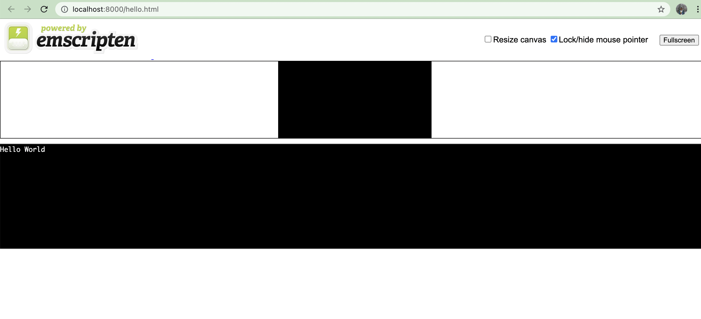
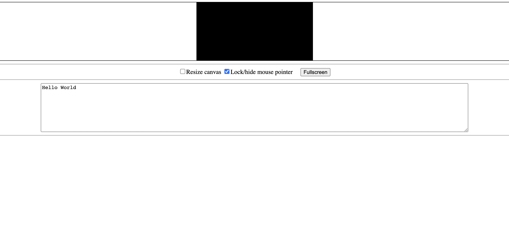
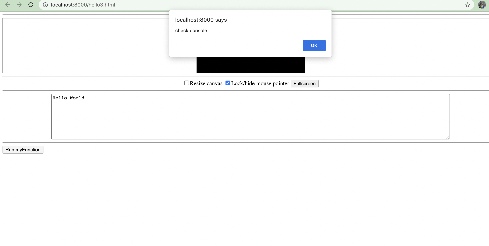
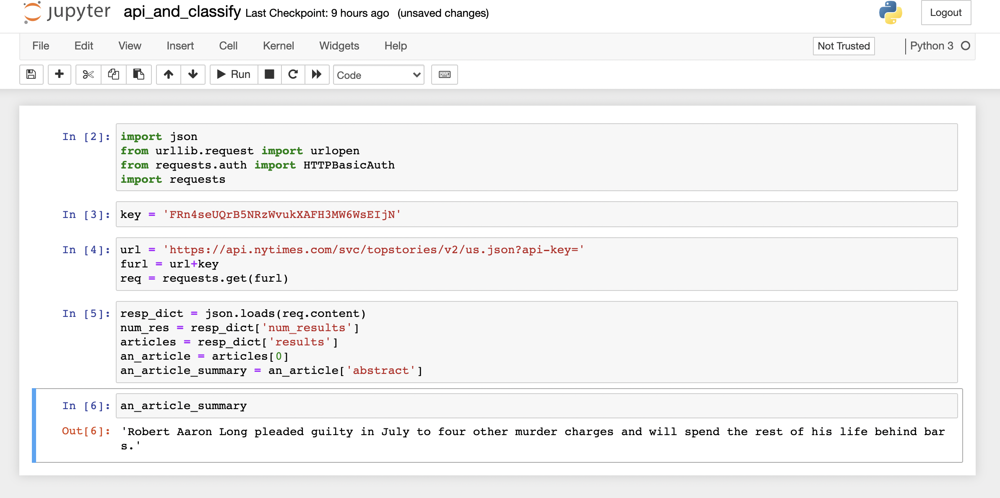

# Hack Technology / Project Attempted

## What you built? 

I learned to compile more complicated C to WASM and display as webpage

I leanred how to use an API in python

## Who Did What?

me

## What you learned

bleep bloop blorp

coding is hard

I learned how to compile C to WASM and display it as a webpage. I also learned how to compile a C library into WASM and display it as a webpage. I also learned how to use an API in python. I started learning how to compile python into C, so that I could go from python -> c -> to WASM, but I didn't have the time (sad emoji) 

## Authors

me

## Acknowledgments

Tutorials:
- [Emscripten](https://emscripten.org/docs/getting_started/Tutorial.html#tutorial)
- [Compiling custom C to WASM](https://developer.mozilla.org/en-US/docs/WebAssembly/C_to_wasm)
- [Compiling C library to WASM](https://developer.mozilla.org/en-US/docs/WebAssembly/existing_C_to_wasm)
- [Compiling C library to WASM](https://developers.google.com/web/updates/2018/03/emscripting-a-c-library)
- [Python API](https://stackoverflow.com/questions/53075939/calling-rest-api-with-an-api-key-using-the-requests-package-in-python)
- [Python API](https://www.oreilly.com/library/view/web-scraping-with/9781491910283/)